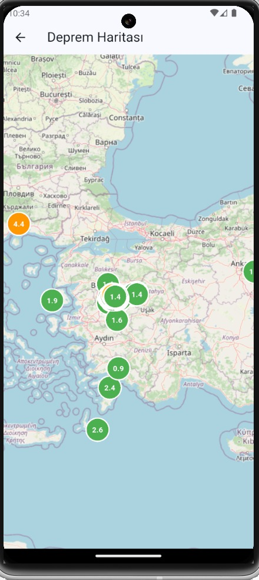
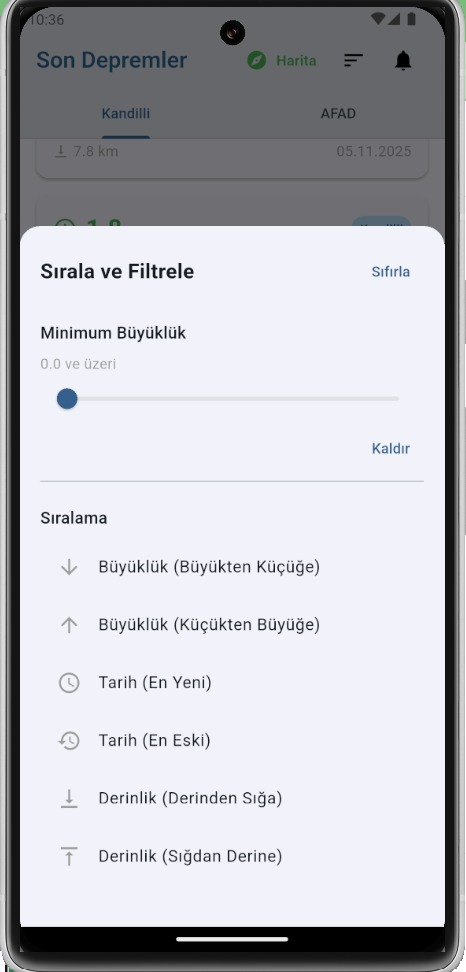
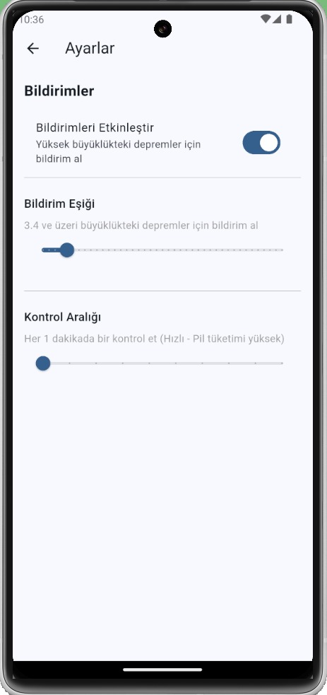

# 🌍 **Earthquake Tracker App**

A mobile application developed with **Flutter** that tracks earthquakes in **Turkey** in **real-time**. It provides users with **instant earthquake information** by utilizing data from **Kandilli Observatory** and **AFAD**.

---

## 📸 **Screenshots**

<div align="center">
  <table>
    <tr>
      <td align="center">
        <br/>
        Main Screen<br/>
        <sub>Real-time earthquake list with source badges</sub>
      </td>
      <td align="center">
        <br/>
       Map View <br/>
        <sub>Interactive OpenStreetMap with color-coded markers</sub>
      </td>
    </tr>
    <tr>
      <td align="center">
        <br/>
       Information Cards <br/>
        <sub>Detailed magnitude, location, and depth info</sub>
      </td>
      <td align="center">
        <br/>
        Settings<br/>
        <sub>Custom notification thresholds and filters</sub>
      </td>
    </tr>
  </table>
</div>

---

## 📱 **Features**

### 🔄 **Real-Time Data Tracking**
- **Dual Source Support**: Tracks **Kandilli Observatory** and **AFAD** data simultaneously.
- **Auto-Update**: Periodic check system every **1 minute** (customizable).
- **Foreground Sync**: Automatic data refresh when the app opens or resumes.
- **Manual Refresh**: **Pull-to-refresh** feature for instant updates.
- **Visual Notifications**: Visual alerts shown when new earthquakes are detected.

### 📊 **Filtering and Sorting**
- **Magnitude Filter**: Filter by **minimum magnitude** value (**0.0 - 8.0**).
- **Sorting Options**:
  - By **Magnitude** (Ascending/Descending)
  - By **Date** (Newest/Oldest)
  - By **Depth** (Deep to Shallow/Shallow to Deep)
- **Dynamic Filtering**: Filters are applied instantly.

### 🗺️ **Map View**
- **Interactive Map**: Visualization of all earthquakes on the map with **OpenStreetMap** integration.
- **Color-Coded Markers**: Marking system according to earthquake magnitude:
  - 🔴 **Red**: Magnitude **≥5.0**
  - 🟠 **Orange**: Magnitude **≥4.0**
  - 🟡 **Yellow**: Magnitude **≥3.0**
  - 🟢 **Green**: Magnitude **<3.0**
- **Marker Details**: View earthquake details by clicking on markers.

### 🔔 **Notification System**
- **Smart Alerts**: Automatic notification sending based on an **adjustable threshold value**.
- **Customizable Threshold**: Set notification threshold between **3.0 - 7.0**.
- **Control Interval**: Set control period between **1-10 minutes**.
- **Lock Screen Support**: Notification display on the lock screen while the app is active.
- **Duplicate Prevention**: Same earthquake is not notified twice.

### 🎨 **Modern UI/UX**
- **Material Design 3**: Modern and user-friendly interface.
- **Colored Magnitude Display**: Dynamic color coding according to earthquake magnitude.
- **Responsive Design**: Compatible with different screen sizes.
- **Smooth Scrolling**: Comfortable scrolling experience with **customized scroll physics**.
- **Smooth Animations**: Fluid transitions and animations.

### 📋 **Detailed Earthquake Information**
Information shown on each earthquake card:
- **Magnitude** (colored and with icon)
- **Location information**
- **Depth (km)**
- **Date and time**
- **Nearest city information**
- **Source badge** (**Kandilli/AFAD**)

---

## 🛠️ **Technologies**

### **Frontend**
- **Flutter**: Cross-platform mobile app development framework.
- **Dart**: Programming language.

### **State Management**
- **Provider**: Central state management with **provider pattern**.

### **API & Data**
- **HTTP**: **REST API** integration.
- **JSON Parsing**: Data modeling and parsing processes.
- **SharedPreferences**: Local data storage (**settings**).

### **Map**
- **flutter_map**: **OpenStreetMap** integration.
- **latlong2**: Coordinate operations.

### **Notifications**
- **flutter_local_notifications**: Local notification system.

### **Other**
- **intl**: Date and time formatting.

---

## 📁 **Project Structure**


```

lib/
├── main.dart                    # Application entry point
├── models/                      # Data models
│   ├── deprem.dart
│   ├── deprem_kaynagi.dart
│   └── siralama_tipi.dart
├── providers/                   # State management
│   └── deprem_provider.dart
├── screens/                     # Screens
│   ├── deprem_listesi_screen.dart
│   ├── harita_screen.dart
│   └── ayarlar_screen.dart
├── services/                    # Services
│   ├── deprem_service.dart
│   └── bildirim_service.dart
└── widgets/                     # Widgets
└── deprem_card.dart

```

---

## 🚀 **Installation**

### **Requirements**
- **Flutter SDK** (3.9.2 or higher)
- **Dart SDK**
- **Android Studio / VS Code**
- **Android SDK** or **iOS SDK**

### **Steps**

1. **Clone the repository**
   ```bash
   git clone [https://github.com/EsraGumus7/deprem-uygulamasi.git](https://github.com/EsraGumus7/deprem-uygulamasi.git)
   cd deprem-uygulamasi

```

2. **Install dependencies**
```bash
flutter pub get

```


3. **Run the application**
```bash
flutter run

```


---

## 📦 **Dependencies**

```yaml
dependencies:
  flutter:
    sdk: flutter
  cupertino_icons: ^1.0.8
  http: ^1.1.0
  provider: ^6.1.1
  intl: ^0.19.0
  flutter_map: ^7.0.2
  latlong2: ^0.9.1
  flutter_local_notifications: ^17.2.3
  shared_preferences: ^2.3.3

```

---

## 🎯 **Key Technical Features**

### **State Management**

* Central state management with **Provider pattern**.
* **Reactive UI** updates with **ChangeNotifier**.
* Optimized **rebuilds** with **Consumer** widgets.

### **API Integration**

* Asynchronous data fetching with **RESTful API**.
* **Error handling** and **timeout** management.
* **JSON parsing** and **model mapping**.
* Dual source (**Kandilli & AFAD**) support.

### **Notification System**

* Push notifications with **Local notifications**.
* Automatic notification via **periodic checks**.
* **Threshold-based** smart notification system.
* **Duplicate prevention** mechanism.

### **User Experience**

* **Automatic update** system.
* **Pull-to-refresh** feature.
* **Filtering** and **sorting**.
* **Map view**.
* **Adjustable parameters**.

---

## 📊 **Project Statistics**

* **Total Lines**: **~1500+** lines of code
* **Number of Files**: **15+** source files
* **Number of Screens**: **3** main screens
* **Number of Services**: **2** service layers
* **Number of Models**: **3** data models

---

## 🔧 **Development Features**

* **Debug Logging**: Detailed log system in terminal.
* **Error Handling**: Comprehensive error management.
* **Code Organization**: Modular and sustainable code structure.
* **Clean Code**: Readable and easy-to-maintain code.

---

## 📝 **License**

This project was developed for **educational** and **CV/Portfolio** purposes.

---

## 👤 **Developer**

**Esra Gümüş**

* **GitHub**: [@EsraGumus7](https://github.com/EsraGumus7)

---

## 🙏 **Acknowledgements**

* Open API support for **Kandilli Observatory** and **AFAD**.

```


# 🌍 Earthquake Tracking App

A Flutter-based mobile application that allows users to track earthquakes in Turkey in real time.  
The app fetches and combines data from **Kandilli Observatory** and **AFAD**, providing up-to-date and reliable earthquake information.

---

## 📸 Screenshots

<div align="center">
  
  
  <br/>
  
  
</div>

---

## 📱 Features

### 🔄 Real-Time Data Tracking
- Dual data source support (Kandilli Observatory & AFAD)
- Automatic data refresh every 1 minute (configurable)
- Automatic refresh when the app is opened or resumed
- Manual refresh with pull-to-refresh
- Visual indicator for newly detected earthquakes

### 📊 Filtering and Sorting
- Magnitude-based filtering (0.0 – 8.0)
- Sorting options:
  - By magnitude (ascending / descending)
  - By date (newest / oldest)
  - By depth (deep to shallow / shallow to deep)
- Instant filtering without reloading data

### 🗺️ Map View
- Interactive map powered by OpenStreetMap
- Color-coded markers based on magnitude:
  - 🔴 Red: ≥ 5.0
  - 🟠 Orange: ≥ 4.0
  - 🟡 Yellow: ≥ 3.0
  - 🟢 Green: < 3.0
- Tap markers to view detailed earthquake information

### 🔔 Notification System
- Smart notifications based on magnitude thresholds
- Customizable notification threshold (3.0 – 7.0)
- Configurable check interval (1–10 minutes)
- Lock screen notification support
- Duplicate notification prevention

### 🎨 Modern UI / UX
- Material Design 3
- Dynamic color coding based on magnitude
- Responsive layout for different screen sizes
- Smooth scrolling with custom scroll physics
- Fluid animations and transitions

### 📋 Detailed Earthquake Information
Each earthquake card displays:
- Magnitude (with color and icon)
- Location
- Depth (km)
- Date and time
- Nearest city
- Data source badge (Kandilli / AFAD)

---

## 🛠️ Technologies

### Frontend
- Flutter – Cross-platform mobile development framework
- Dart – Programming language

### State Management
- Provider – Centralized state management pattern

### API & Data
- HTTP – REST API integration
- JSON parsing and data modeling
- SharedPreferences – Local storage for user settings

### Map
- flutter_map – OpenStreetMap integration
- latlong2 – Coordinate operations

### Notifications
- flutter_local_notifications – Local notification system

### Others
- intl – Date and time formatting

---

## 📁 Project Structure

```text
lib/
├── main.dart
├── models/
├── providers/
├── screens/
├── services/
└── widgets/
````

---

## 🚀 Installation

### Requirements

* Flutter SDK (3.9.2 or higher)
* Dart SDK
* Android Studio / VS Code
* Android SDK or iOS SDK

### Steps

```bash
git clone https://github.com/EsraGumus7/deprem-uygulamasi.git
cd deprem-uygulamasi
flutter pub get
flutter run
```

---

## 🎯 Technical Highlights

* Provider-based state management
* RESTful API integration with proper error handling
* Dual earthquake data source support
* Threshold-based smart notification system
* Modular and maintainable project architecture

---

## 👤 Developer

Esra Gümüş
GitHub: [@EsraGumus7](https://github.com/EsraGumus7)


# 🌍 Deprem Takip Uygulaması

Türkiye'deki depremleri gerçek zamanlı takip eden, Flutter ile geliştirilmiş mobil uygulama. Kandilli Rasathanesi ve AFAD verilerini kullanarak kullanıcılara anlık deprem bilgileri sunar.

## 📸 Ekran Görüntüleri

<div align="center">
  
  
  <br/>
  
  
</div>

## 📱 Özellikler

### 🔄 Gerçek Zamanlı Veri Takibi
- **Çift Kaynak Desteği**: Kandilli Rasathanesi ve AFAD verilerini aynı anda takip eder
- **Otomatik Güncelleme**: Periyodik kontrol sistemi ile her 1 dakikada bir otomatik veri güncellemesi (ayarlanabilir)
- **Uygulama Açılışında Güncelleme**: Uygulama açıldığında veya ön plana geldiğinde otomatik veri yenileme
- **Manuel Yenileme**: Pull-to-refresh özelliği ile anında veri güncelleme
- **Yeni Deprem Bildirimi**: Yeni depremler eklendiğinde görsel bildirim gösterimi

### 📊 Filtreleme ve Sıralama
- **Büyüklük Filtresi**: Minimum büyüklük değerine göre filtreleme (0.0 - 8.0)
- **Sıralama Seçenekleri**:
  - Büyüklüğe göre (Artan/Azalan)
  - Tarihe göre (En Yeni/En Eski)
  - Derinliğe göre (Derinden Sığa/Sığdan Derine)
- **Dinamik Filtreleme**: Filtreler anlık olarak uygulanır

### 🗺️ Harita Görünümü
- **İnteraktif Harita**: OpenStreetMap entegrasyonu ile tüm depremlerin harita üzerinde görselleştirilmesi
- **Renkli Marker'lar**: Deprem büyüklüğüne göre renkli işaretleme sistemi
  - 🔴 Kırmızı: ≥5.0 büyüklükte
  - 🟠 Turuncu: ≥4.0 büyüklükte
  - 🟡 Sarı: ≥3.0 büyüklükte
  - 🟢 Yeşil: <3.0 büyüklükte
- **Marker Detayları**: Marker'lara tıklanarak deprem detaylarını görüntüleme

### 🔔 Bildirim Sistemi
- **Akıllı Bildirimler**: Ayarlanabilir eşik değerine göre otomatik bildirim gönderimi
- **Özelleştirilebilir Eşik**: 3.0 - 7.0 arası bildirim eşiği ayarlama
- **Kontrol Aralığı**: 1-10 dakika arası kontrol periyodu ayarlama
- **Kilitli Ekran Desteği**: Uygulama açıkken kilitli ekranda da bildirim gösterimi
- **Tekrar Önleme**: Aynı deprem tekrar bildirilmez

### 🎨 Modern UI/UX
- **Material Design 3**: Modern ve kullanıcı dostu arayüz
- **Renkli Büyüklük Gösterimi**: Deprem büyüklüğüne göre dinamik renk kodlaması
- **Responsive Tasarım**: Farklı ekran boyutlarına uyumlu
- **Yavaş Kaydırma**: Özelleştirilmiş scroll physics ile rahat kaydırma deneyimi
- **Smooth Animations**: Akıcı geçişler ve animasyonlar

### 📋 Detaylı Deprem Bilgileri
Her deprem kartında gösterilen bilgiler:
- Büyüklük (renkli ve ikonlu)
- Lokasyon bilgisi
- Derinlik (km)
- Tarih ve saat
- En yakın şehir bilgisi
- Kaynak badge (Kandilli/AFAD)

## 🛠️ Teknolojiler

### Frontend
- **Flutter**: Cross-platform mobil uygulama geliştirme framework'ü
- **Dart**: Programlama dili

### State Management
- **Provider**: State management pattern ile merkezi durum yönetimi

### API & Veri
- **HTTP**: REST API entegrasyonu
- **JSON Parsing**: Veri modelleme ve parse işlemleri
- **SharedPreferences**: Yerel veri saklama (ayarlar)

### Harita
- **flutter_map**: OpenStreetMap entegrasyonu
- **latlong2**: Koordinat işlemleri

### Bildirimler
- **flutter_local_notifications**: Lokal bildirim sistemi

### Diğer
- **intl**: Tarih ve saat formatlama

## 📁 Proje Yapısı

```
lib/
├── main.dart                    # Uygulama giriş noktası
├── models/                     # Veri modelleri
│   ├── deprem.dart
│   ├── deprem_kaynagi.dart
│   └── siralama_tipi.dart
├── providers/                  # State management
│   └── deprem_provider.dart
├── screens/                    # Ekranlar
│   ├── deprem_listesi_screen.dart
│   ├── harita_screen.dart
│   └── ayarlar_screen.dart
├── services/                  # Servisler
│   ├── deprem_service.dart
│   └── bildirim_service.dart
└── widgets/                   # Widget'lar
    └── deprem_card.dart
```

## 🚀 Kurulum

### Gereksinimler
- Flutter SDK (3.9.2 veya üzeri)
- Dart SDK
- Android Studio / VS Code
- Android SDK veya iOS SDK

### Adımlar

1. **Repository'yi klonlayın**
   ```bash
   git clone https://github.com/EsraGumus7/deprem-uygulamasi.git
   cd deprem-uygulamasi
   ```

2. **Bağımlılıkları yükleyin**
   ```bash
   flutter pub get
   ```

3. **Uygulamayı çalıştırın**
   ```bash
   flutter run
   ```

## 📦 Kullanılan Paketler

```yaml
dependencies:
  flutter:
    sdk: flutter
  cupertino_icons: ^1.0.8
  http: ^1.1.0
  provider: ^6.1.1
  intl: ^0.19.0
  flutter_map: ^7.0.2
  latlong2: ^0.9.1
  flutter_local_notifications: ^17.2.3
  shared_preferences: ^2.3.3
```

## 🎯 Öne Çıkan Teknik Özellikler

### State Management
- Provider pattern ile merkezi state yönetimi
- ChangeNotifier ile reactive UI güncellemeleri
- Consumer widget'ları ile optimize edilmiş rebuild'ler

### API Entegrasyonu
- RESTful API ile asenkron veri çekme
- Error handling ve timeout yönetimi
- JSON parsing ve model mapping
- Çift kaynak (Kandilli & AFAD) desteği

### Bildirim Sistemi
- Local notifications ile push bildirimleri
- Periyodik kontrol ile otomatik bildirim
- Eşik tabanlı akıllı bildirim sistemi
- Tekrar önleme mekanizması

### Kullanıcı Deneyimi
- Otomatik güncelleme sistemi
- Pull-to-refresh özelliği
- Filtreleme ve sıralama
- Harita görünümü
- Ayarlanabilir parametreler

## 📊 Proje İstatistikleri

- **Toplam Satır**: ~1500+ satır kod
- **Dosya Sayısı**: 15+ kaynak dosya
- **Ekran Sayısı**: 3 ana ekran
- **Servis Sayısı**: 2 servis katmanı
- **Model Sayısı**: 3 veri modeli

## 🔧 Geliştirme Özellikleri

- **Debug Logging**: Terminal'de detaylı log sistemi
- **Error Handling**: Kapsamlı hata yönetimi
- **Code Organization**: Modüler ve sürdürülebilir kod yapısı
- **Clean Code**: Okunabilir ve bakımı kolay kod

## 📝 Lisans

Bu proje eğitim ve CV amaçlı geliştirilmiştir.

## 👤 Geliştirici

**Esra Gümüş**

- GitHub: [@EsraGumus7](https://github.com/EsraGumus7)

## 🙏 Teşekkürler

- Kandilli Rasathanesi ve AFAD için açık API desteği
- Flutter topluluğu
- OpenStreetMap harita servisi

---

⭐ Projeyi beğendiyseniz yıldız vermeyi unutmayın!
